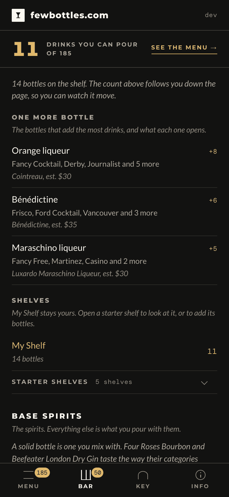
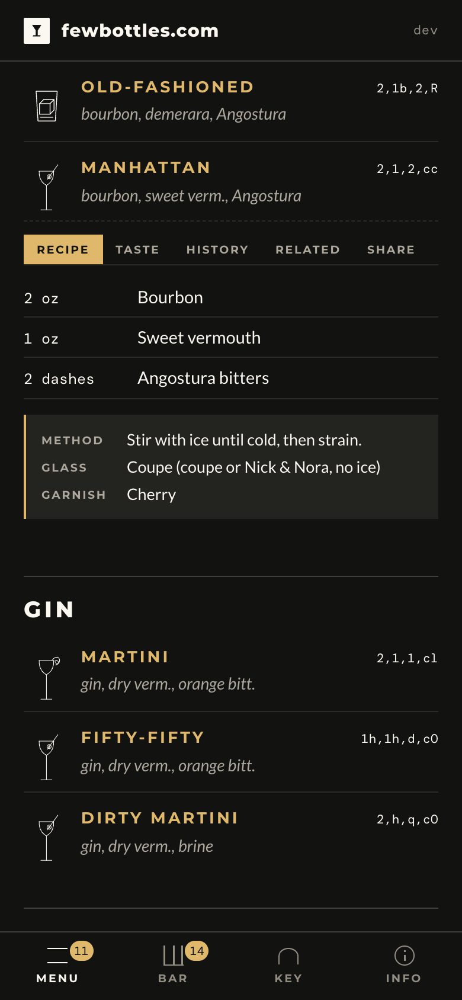
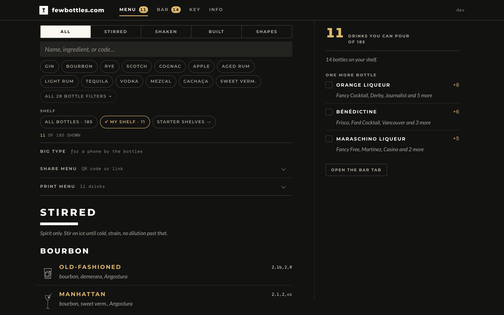
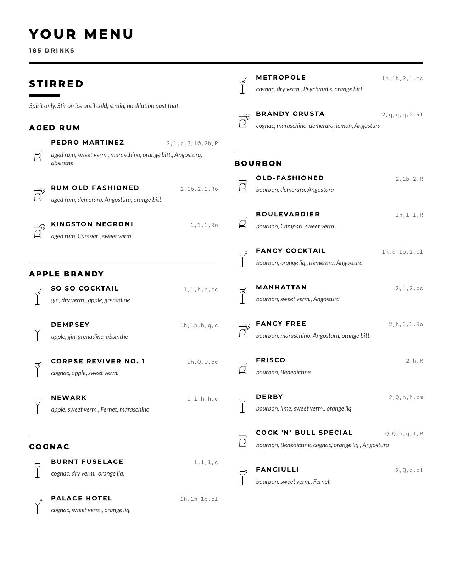

# fewbottles.com

My printed menu, decoded. Tick what you have, see what you can pour tonight, and which bottle to buy next.

<!-- numbers from make stats -->
Over a hundred and fifty classics, three methods, one small bar. No
build step, no framework, no database. The app renders from four JSON
files: three written by hand, and `kin.json` generated from them.

Live at **[fewbottles.com](https://fewbottles.com)**. `drink.shoephone.net`
still opens the menu and sends you here.

<table>
<tr>
<td></td>
<td></td>
</tr>
</table>





## How it is built

Every drink id and shelf bit is a key that never moves, every shorthand
code is regenerated from its recipe and refused if the two disagree, and
nothing is committed until I have read the diff.

## What it does that paper cannot

**Decodes the shorthand.** Every drink carries the house code exactly as
printed, `2,1,q,3,10,2b,R`, and the long drinks added since are written
in the same shorthand. Tapping one spells the drink out in ounces,
dashes, glass and garnish. The codes are contextual, so the
decoder reads each amount against the ingredient it belongs to: a bare
`2` is two ounces of rye and two dashes of Angostura.

**Answers "what can I actually make?"** The Bar tab is a shelf
inventory. Tick the bottles you own and the menu marks what is pourable,
what is one bottle short, and which bottle it is. The whole point of
this bar is range from few bottles, so every unopened bottle shows what
it would add, counted in drinks unlocked rather than drinks it appears in.

That number is frequently surprising.

<!-- numbers from make stats -->
From gin, bourbon, both vermouths, two bitters and the staples you can
pour 11 drinks; the best next bottle is not a spirit at all but orange
liqueur, at +8, then Bénédictine at +6 and maraschino liqueur at +5.

**Turns the shelf into a menu.** Tapping the count on the Bar tab opens
the list it counts. Print menu is a
reveal on that list: name the menu, keep the glass icon or drop it,
tick recipe, taste or history if you want them on paper, and add a
Barline sheet if a guest needs the key. Two columns on letter, a QR
back to the site. Share menu, above it, is the same list as a link: the
shelf packed into one number on the end of the address, shown as a QR
to scan or sent by text, and opened live on the guest's own phone
without touching their shelf.

**Filters the way you choose a drink.** Stirred, shaken or built, then by
any spirit or modifier, then by what the shelf can actually support.
Shapes regroups the same list by shape (Martini, Sour, Daisy), so the
Manhattan sits with the Martini as well as under bourbon.

**Names the other drinks of the same shape.** A Related pane on every recipe
lists the nearest swaps (`scotch for bourbon`) and leads through to the
family those drinks sit in.

## Layout

| Path | What it is |
|------|-----------|
| `index.html` | The whole shell. Four tabs, no router beyond the hash. |
| `assets/app.js` | Decoder, filters, and the marginal-gain engine. |
| `assets/app.css` | Every colour is a token, defined twice: dark and light. |
| `data/cocktails.json` | The menu. Each drink carries both a `code` and a `build`. |
| `data/bar.json` | Every bottle any drink can call for, garnish included. |
| `data/notation.json` | The shorthand key, and what the decoder reads from. |
| `data/kin.json` | Generated families of shape, and each drink's nearest neighbours. |
| `data/dates.json` | Generated: when each drink was added and last changed, for the drink pages and the sitemap. |
| `scripts/check_menu.py` | Regenerates each code from its build and refuses a mismatch. |
| `scripts/kin.py` | Rebuilds `data/kin.json` from the builds. `--check` refuses a drift. |
| `scripts/check_assets.py` | Missing files, and ids `app.js` reaches for that nothing renders. |
| `scripts/stats.py` | The counts the copy quotes. `make stats` prints the README sentence. |
| `assets/glasses/all.json` | Generated: every glass drawing in the one file the menu fetches. |
| `llms.txt` | Map for agents: what this is, and a one-line index of every drink. |
| `llms-full.txt` | The menu spelled out. Generated; `make verify` refuses a drift. |
| `drink/<id>/index.html` | One page per drink, generated by `scripts/pages.py`: the recipe in the HTML, a Recipe block of JSON-LD, the card in the meta tags. |
| `drink/index.html` | Generated: the index of every drink, A to Z. The one page the front page links that leads to all the rest. |
| `menu/<family>/index.html` | Generated: one section of the printed card, and the drinks that print under it. |
| `shape/<pattern>/index.html` | Generated: one of the shapes `kin.py` files, and the drinks built to it. |
| `assets/cards/<id>.png` | The share card a drink link unfurls into, drawn by `scripts/cards.py` from the same JSON and glass art. |
| `robots.txt` / `sitemap.xml` | Crawler entry. The sitemap lists the front page, every hub and every drink page. |
| `worker/index.js` | Redirect-only: evicts the old `drink.shoephone.net` service worker, then 301s. |

## Working on it

```sh
make serve     # http://localhost:8010, no-store, so edits show up
make verify    # the whole pipeline
make kin       # rebuild data/kin.json from the builds
make llms      # rebuild llms.txt and llms-full.txt from the menu
make glasses   # rebuild assets/glasses/all.json from the SVGs
make icons     # redraw the home-screen PNG and the X/social card
make events    # the custom events the app sends, straight from the source
make stats     # the figures the copy quotes, and the README sentence to paste
make probe     # the live origin: https redirect, HSTS, security headers, CSP hashes
```

`make verify` is the only gate. It parses every JSON file, syntax-checks
the scripts, and checks that every shorthand code still agrees with the
recipe it stands for and every generated file still matches the menu.
There is no `package.json`, so `scripts/check_code.py` is the linter
(function size, complexity, and the foot-guns a static site cannot
afford) and `scripts/check_style.py` holds the house rules.
`scripts/test_checks.py` breaks every rule on purpose and fails if a
checker sleeps through it, and `scripts/app.test.mjs` runs `app.js` under
`node:test` on the real data.

The service worker registers in production only, and off https the app
actively unregisters any worker it finds. A worker owns an *origin*, not
a project: every static site here serves `./`, `index.html` and
`assets/app.js`, so one left on `localhost:8000` will answer for the next
project that runs there, cache-first, with no server needed. This repo
serves on **8010** so the origins never overlap. If a page ever loads
with nothing listening on the port, that is what you are looking at;
`make unstick` prints the manual recovery.

Pushes to `main` run `make check` and deploy nothing. Pushing a `v*` tag
runs the same checks, copies only the files the site serves into `_site`
with `scripts/stage.py`, stamps the tag into that copy (`sw.js`,
`assets/app.js`, and a `?v=` on the stylesheet and script tags), deploys
it to GitHub Pages, and then cuts a GitHub release for that tag with
generated notes. `make stage V=v9.9.9` rehearses the staging locally. The tag is the only place a version is written: the app
prints it in the top bar and on the Info tab, and an unstamped working
copy reads `dev`. GitHub Pages is the origin for fewbottles.com.
`drink.shoephone.net` is a Cloudflare Worker that evicts the old service
worker and 301s here. It does not serve the menu, and a content push
does not need `wrangler`.

## What is counted

The site runs Google Analytics through Google Tag Manager, and Cloudflare
Web Analytics counts page views and load times. Both count what gets used,
in aggregate: which tab opened, which drink was expanded,
which bottle was ticked, whether a menu was printed or shared. There is
no account and no name to attach any of it to, the shelf itself never
leaves your phone unless you share it, and nothing is sold to anyone. A
content blocker stops both and the site works exactly the same. The
same statement is on the Info tab on the site.

The events are the `track()` calls in `assets/app.js`. `make events`
prints the current list, which is better than a copy here that goes stale
the next time one is added.

## Adding a drink

Add one object to `cocktails` in `data/cocktails.json`:

```json
{ "id": "red-hook", "name": "Red Hook", "method": "stirred",
  "family": "rye", "code": "2,h,h,cc", "serve": "cc",
  "build": [["rye","2"],["sweet-vermouth","h"],["maraschino","h"]] }
```

`code` and `build` are two hands writing the same drink, which is exactly
why the checker compares them. Write the code as it appears on the paper
menu, spell the build out, and let `make verify` catch the disagreement.

Then run `make kin` so the new drink joins its family, `make llms` so it
lands in the agent dumps, `make pages` so it gets its own address and
joins the index, its section and its shape, and
`make cards` so that address unfurls into a picture. Verify fails on a
stale copy of any of the four. Cards are the one step with something to
install: Pillow and rsvg-convert draw them, though the check that they
are current needs neither.

Ingredients that take no measure (egg white, muddled mint) get `null`. An ingredient
poured on top rather than into the shaker, like the bitters in a `c3`
sour, gets a third element, `"g"`, so it counts toward what the drink needs
without appearing among the comma-separated amounts.

Any new bottle goes in `data/bar.json` first, or the checker rejects it.
